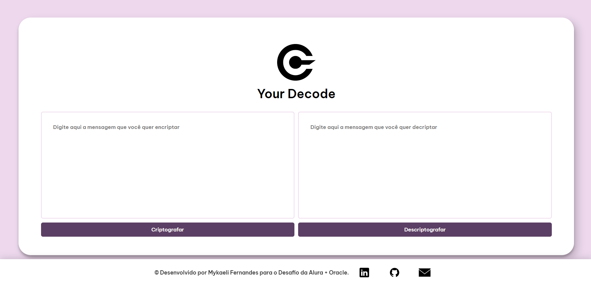

 
<h1>Your Decoder</h1>
Decodificador de textos criado em HTML,CSS e JavaScript para o Desafio Alura + Oracle.
 
<h2>▶ Acesse <a href="https://mykaelifernandes.github.io/your-decode/">clicando aqui</a>.</h2>
 

💻 Tecnologias Utilizadas:

  
  
  
    
   
  <h3>Preview:<h3>
  

